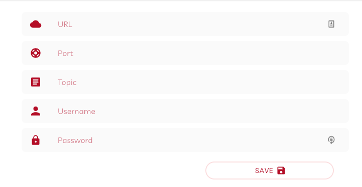

## About
This is the front-end of an IoT Monitor built using Ionic/Angular and leveraging MQTT.

## Features
- Authentication using JWT
- Add different brokers
- Add topics
- Monitor your live sensor data

## Setting up
- Clone the repo & navigate to it `git clone https://github.com/falcononrails/iotmonitor-ionic.git && cd iotmonitor-ionic` 
- Install all dependencies `npm install`
- Run the app `ionic serve`

## Usage
After signing up and signing in, a typical scenario is as follows: 
- Create an account in [CloudMQTT](https://www.cloudmqtt.com)
- Set up an instance
- Add the server, username, password and port from your Cloud MQTT instance and save.  

- You can now click on the graph icon to display your live data.

