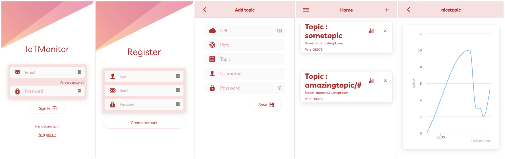

## About
This is the front-end of an IoT Monitor built using Ionic/Angular and leveraging MQTT.  

## Libraries used
- [Eclipse Paho](https://www.eclipse.org/paho/clients/js/) for MQTT support.
- [Highcharts](https://www.npmjs.com/package/highcharts) for graph diplay.

## Features
- Authentication using JWT.
- Adding different brokers.
- Adding topics.
- Monitoring your live sensor data.

## Setting up
- Clone the repo & navigate to it `git clone https://github.com/falcononrails/iotmonitor-ionic.git && cd iotmonitor-ionic` 
- Install all dependencies `npm install`
- Run the app `ionic serve`
- This front-end uses a [Node JS hosted back-end](https://iotmonitor-backend.herokuapp.com). In order to specifiy your own backend, change the **backend_url** variable in the files *authentification-service.service.ts* and *topic-manager.service.ts*.

## Usage
After signing up and signing in, a typical scenario is as follows: 
- Create an account in [CloudMQTT](https://www.cloudmqtt.com).
- Set up an instance.
- Add the server, username, password and port (it should support websockets) from your Cloud MQTT instance and save.  

- You can now use the CloudMQTT Websockets UI to send data & click on the graph icon to display your live data.
- In order to display data from a sensor, subscribe to the same topic as in the app, connect your sensor to CloudMQTT, and bingo!

